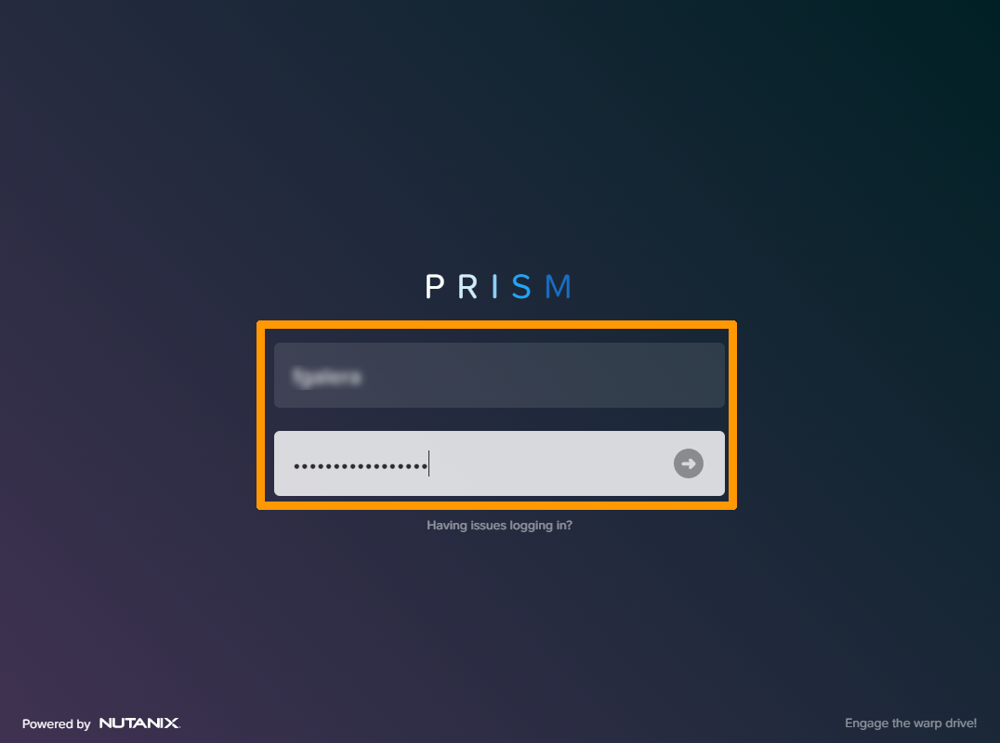
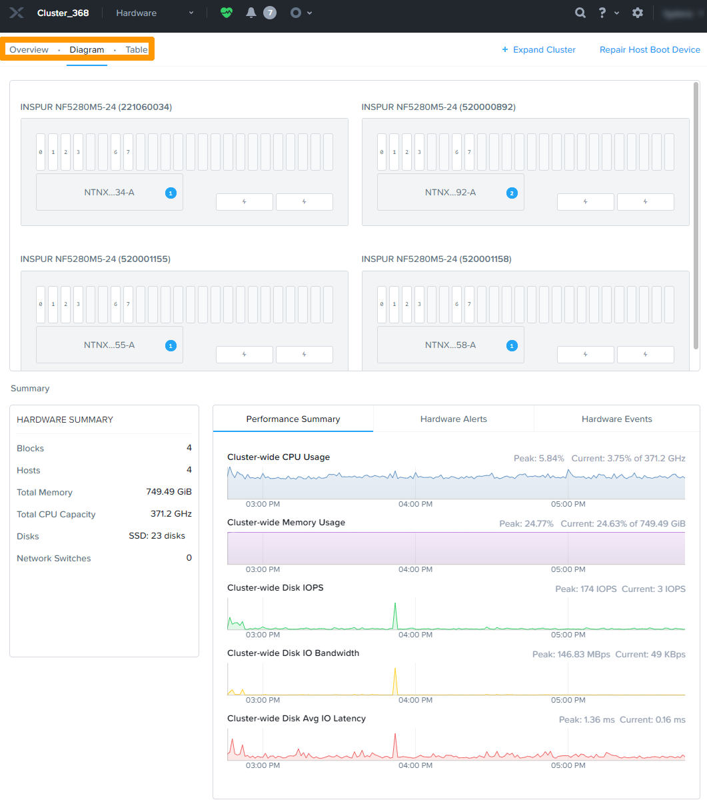

**Dernière mise à jour le 22/02/2022**

## Objectif

Ce document rappelle le fonctionnement d'une solution d'hyperconvergence NUTANIX et propose une découverte de l'interface Prim Central et PRISM element. Le choix d'OVHcloud est d'utiliser NUTANIX sur un hyperviseur AHV.

## Prérequis

Avoir une solution NUTANIX opérationnelle d'OVHcloud.

## Présentation de la solution technique

### Rappel sur la définition d'un nœud

Une solution NUTANIX est composée de ce que l'on appelle des nœuds, un nœud est en fait un ordinateur physique, sur cet ordinateur se trouve :
* Un disque système ou deux disques systèmes en RAID. Sur ce disque système est installé l'hyperviseur AHV. 
* Un disque SSD ou est stocké la CVM *Machine virtuelle qui assure les connexions entre chaque nœud et qui est une composante essentielle de la solution NUTANIX*,sur ce disque si il y'a de la place il peut servir pour le stockage de données.
* D'autres disques SSD ou SAS avec un cout de licence diffèrent en fonction de la technologie de stockage choisie.
* Un ou plusieurs processeurs.
* De la mémoire.
* Parfois une carte graphique **GPU**.

Dans l'idéal il faudrait que chaque nœud d'un cluster NUTANIX soit identique mais il peut arriver qu'il y'ait des différences notamment sur la présence de GPU **Graphical Processor Unit**, mais les nœuds qui contiennent du stockage doivent être identiques.

### Fonctionnement du cluster NUTANIX

Un cluster est créé à partir des nœuds du cluster, il faut au minimum 3 nœuds pour faire fonctionner un cluster NUTANIX.

Lors de la création d'un CLUSTER tous les disques disponibles sont ajoutés dans ce que l'on appelle un *Storage POOL* il est conseillé de n'avoir qu'un seul Storage POOL.

Pour rappel la solution NUTANIX d'OVHcloud commence à 3 nœuds et peut aller jusqu'a 18 nœuds.

La redondance des données ne se fait pas sur un nœud comme avec du RAID mais au travers du réseau sur plusieurs nœuds, il y'a plusieurs niveaux de redondances :

* RF2: Les données sont disponibles sur 2 nœuds, ce qui permet la défaillance d'un nœud ou d'un disque de données sur 1 des nœuds.
* RF3: Les données sont disponibles sur 3 nœuds, cette solution n'est possible qu'a partir de 5 nœuds, elle est plus sécurisée car elle permet la perte de deux nœuds avec une capacité de stockage moindre.

### Présentation de la virtualisation

La virtualisation se fait au travers de l'hyperviseur AHV. 

Cet hyperviseur est intégré sur chaque nœud et ne nécessite pas de licences supplémentaire.

Les ordinateurs virtuels fonctionnent sur un des nœuds et peuvent basculer à chaud d'un nœud à l'autre en fonctionnement normal.

En cas de défaillance d'un nœud les ordinateurs virtuels redémarrent sur un des nœuds.

### Diverses possibilités de connexion à un CLUSTER NUTANIX

* A partir de l'interface WEB Prism Central **Machine virtuelle supplémentaire qui possède des fonctionnalités que n'a pas PRISM Element et qui permet de se connecter à un ou plusieurs clusters**.
* Sur l'interface WEB Prism ELEMENT **C'est en fait une des CVM**.
* En SSH sur le cluster **Dans ce cas-là c'est aussi une des CVM**.
* En SSH sur un des nœuds du cluster pour des opérations de maitenance sur l'hyperviseur.

Au travers de prism Central et de Prism Element il est possible d'utiliser l'interface RESTAPI pour automatiser certaines tâches en ligne de commande.

## En pratique

Maintenant que la solution NUTANIX a été présenté nous allons nous connecter aux interfaces WEB de NUTANIX et découvrir le stockage.

### Connexion à Prism Central depuis INTERNET

Nous allons nous connecter au travers de PRISM Central qui est le point d'entrée depuis INTERNET dans la solution proposée par OVHcloud.

L'accès au cluster se fait au travers d'une adresse publique sur une adresse du type [https://FQDN:9440](https://FQDN:9440) Cette adresse est fournie au client lors de la création d'un CLUSTER NUTANIX chez OVHcloud.

Dans la partie encadrée saisir un nom d'utiliateur et un mot de passe et cliquer sur la flêche.

### Connexion à Prism Element au travers de PRISM Central

Sur le tableau de bord de prism central cliquer sur le nom du cluster dans **Cluster Quick Access** là ou se trouve l'encadrement.

Sur la sélection à droite apparait le nombre de Disques en totalité, le nombre de VMs ainsi que le le nombre d'hote. Un coeur de couleur verte indique que le cluster NUTANIX fonctionne correctement. En bas de cet encadré est affiché le niveau de tolérance de panne **1 signifie que nous sommes en RF2 avec la possibilité d'une perte d'un disque sur un nœud ou un nœud entièrement**.

Sur la sélection à gauche est affiché un résumé du stockage, de l'espace disque en cliquant sur view Details nous aurons plus d'information sur le stockage.

Dans cette fenêtre on peut voir l'état du stockage par nœud.

Aller dans le menu hardware en cliquant sur **Hardware** et nous aurons le détail par Nœud du stockage avec le nombre de disques alloués par nœud.

Pour avoir ce résumé dans l'encadré en haut il faut cliquer sur Diagram.

## Aller plus loin

Site très interessant sur le fonctionnement de NUTANIX [The nutanix BIBLE](https://www.nutanixbible.com/)

Échangez avec notre communauté d'utilisateurs sur <https://community.ovh.com/>.
